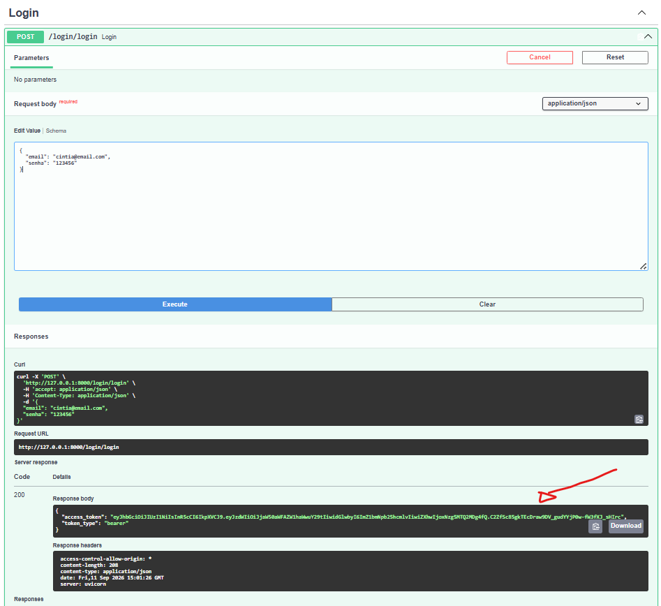
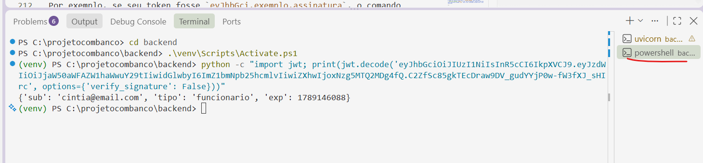
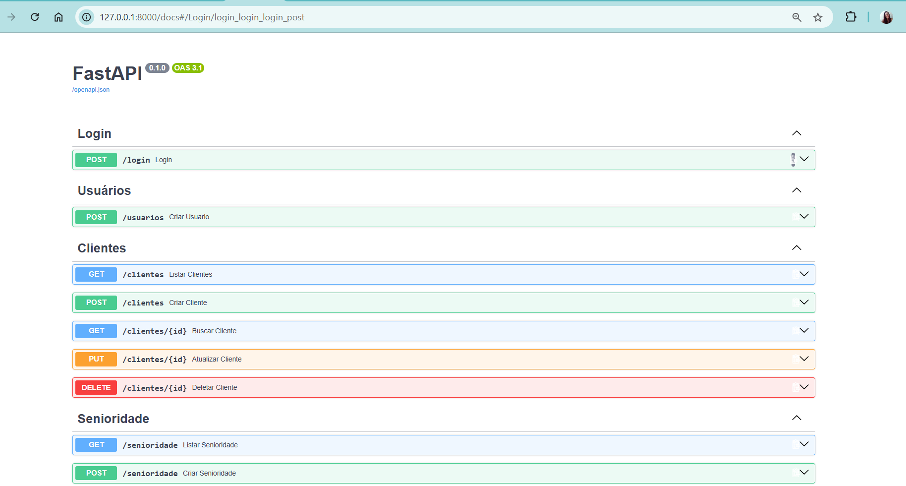

# Aula 13 — Login com Token JWT

## Antes de começar — relembrando o ambiente

Se a máquina foi reiniciada desde a última aula, repita os passos de sempre antes de continuar:

1. **Importe o banco de novo** no phpMyAdmin, aba **Importar**, usando `banco/estudio_tatuagem.sql` (com a tabela `usuario` da Aula 12).
2. **Recrie o arquivo `.env`** dentro da pasta `backend` (nessa aula ele vai ganhar uma linha nova — veja a Parte 2):
   ```
   DB_HOST=localhost
   DB_USER=root
   DB_PASSWORD=
   DB_NAME=estudio_tatuagem
   ```
3. **Recrie e ative o ambiente virtual**, dentro da pasta `backend`:
   ```powershell
   cd backend
   python -m venv venv
   .\venv\Scripts\Activate.ps1
   ```
4. **Reinstale as dependências e rode a API:**
   ```powershell
   pip install -r requirements.txt
   uvicorn main:app --reload
   ```

> **Lembrete das Aulas 7/8:** você vai criar o arquivo `rotas/login.py` nessa aula. Se ele não aparecer em `/docs` com o servidor já ligado, pare com **Ctrl+C** e rode `uvicorn main:app --reload` de novo.

---

## O que vamos fazer nessa aula

1. Entender o que é um token JWT, com bastante calma
2. Criar uma "chave secreta" que só o nosso servidor conhece
3. Criar a rota de login: conferir a senha e devolver o token
4. Ver o "conteúdo" de um token gerado, de verdade

---

## Parte 1 — O que é um token JWT

Imagina uma festa de formatura com lista de convidados. Quando você chega, alguém confere seu nome na lista **uma vez**, na entrada — e te dá uma **pulseirinha**. Depois disso, você pode ir e voltar, entrar em qualquer área liberada, sem precisar mostrar documento de novo toda hora: só mostra a pulseirinha. Os seguranças de cada área não conhecem seu rosto, só confiam na pulseirinha, porque ela tem um selo que ninguém de fora consegue falsificar.

Um **token JWT** ("JSON Web Token") é essa pulseirinha, só que digital:

- Você loga **uma vez** (manda e-mail e senha).
- Se estiver certo, o servidor devolve um **token** — um texto longo e embaralhado.
- A partir daí, seu navegador guarda esse token e mostra ele a cada nova ação, em vez de mandar a senha de novo.
- O token carrega dentro dele algumas informações (tipo "quem é" e "até quando vale"), e uma **assinatura** — um selo que só quem conhece a "chave secreta" do servidor consegue gerar. Ninguém de fora consegue inventar um token falso sem essa chave.

> **Curiosidade:** um JWT de verdade tem 3 partes separadas por pontos (`cabecalho.corpo.assinatura`). As duas primeiras não são criptografadas — qualquer um consegue "abrir" e ler o que tem dentro, só colando o token em [jwt.io](https://jwt.io) (é só um decodificador, não manda o token pra lugar nenhum). O que impede alguém de forjar um token não é esconder o conteúdo, é a **assinatura** — sem a chave secreta certa, é impossível gerar uma assinatura que bata.

---

## Parte 2 — Backend: criando a chave secreta

Essa é a chave que o servidor usa pra "selar" cada token — se ela vazar, qualquer pessoa consegue forjar um crachá válido, então ela segue a mesma regra de sempre: **nunca no código, sempre no `.env`.**

Gere uma chave aleatória rodando isso no terminal (com o venv ativado):

```powershell
python -c "import secrets; print(secrets.token_hex(32))"
```

Vai aparecer um texto longo, tipo `f4a1c9e8b7d6...`. Copie esse texto e adicione uma linha nova no `backend/.env`:

```
SECRET_KEY=cole_aqui_o_texto_que_apareceu
```

Seu `.env` vai ficar com algo desse tipo, só que com uma chave diferente (a que foi gerada na sua máquina):

```
DB_HOST=localhost
DB_USER=root
DB_PASSWORD=
DB_NAME=estudio_tatuagem

SECRET_KEY=xxxxxxxxxxxxxxxxxxxxxxxxxxxxxxxxxxxxxxxxxxxxxxxxxxxxxxxxxxxxxxxx
```

> Esse `xxxx...` acima é só ilustrativo — a sua chave de verdade vai ser a sequência de letras e números que apareceu no seu terminal, bem diferente disso.

> Cada pessoa/máquina deve ter a sua própria `SECRET_KEY` — não tem problema ser diferente da de outro aluno, o importante é que o mesmo servidor sempre use a mesma chave (senão os tokens que ele mesmo gerou deixam de ser reconhecidos por ele).
>
> **Se a máquina do laboratório resetar, você vai gerar uma chave nova toda vez que recriar o `.env`** — e não tem problema nenhum nisso. É como trocar o selo dos crachás de um dia pro outro: os tokens gerados com a chave de ontem simplesmente param de valer, mas você não precisa deles — é só logar de novo (Parte 5) que ganha um token novo, já assinado com a chave de hoje.

---

## Parte 3 — Backend: instalando o PyJWT

```powershell
pip install pyjwt
pip freeze > requirements.txt
```

---

## Parte 4 — Backend: a rota de login

Crie `backend/rotas/login.py`:

```python
# ============================================================
# rotas/login.py — Login com Token JWT
# Descrição: Confere e-mail e senha, e devolve um token JWT
#            (o "crachá digital") se estiverem corretos.
# ============================================================

from fastapi import APIRouter
from pydantic import BaseModel
from datetime import datetime, timedelta, timezone
from database import conectar
import bcrypt
import jwt
import os

router = APIRouter()

SECRET_KEY = os.getenv("SECRET_KEY")   # a chave que assina os tokens, vinda do .env
ALGORITMO = "HS256"                    # o "tipo de selo" usado pra assinar

# Modelo de dados — o que o formulário de login precisa mandar
class Login(BaseModel):
    email: str
    senha: str

# POST /login — confere email e senha, devolve um token se estiverem certos
@router.post("/login")
def login(dados: Login):
    conn = conectar()
    cursor = conn.cursor(dictionary=True)
    cursor.execute("SELECT * FROM usuario WHERE email = %s", (dados.email,))
    usuario = cursor.fetchone()
    conn.close()

    # se o e-mail não existir, nem vale a pena conferir senha nenhuma
    if not usuario:
        return {"erro": "E-mail ou senha inválidos"}

    # confere a senha digitada com o hash guardado no banco (mesma lógica do "triturador" da Aula 12)
    senha_confere = bcrypt.checkpw(dados.senha.encode("utf-8"), usuario["senha"].encode("utf-8"))

    if not senha_confere:
        return {"erro": "E-mail ou senha inválidos"}
        # repare que a mensagem é igual, tanto pra "e-mail não existe" quanto pra "senha errada" —
        # de propósito, pra não dar pista de qual das duas coisas a pessoa errou

    # monta o "conteúdo" do crachá: quem é, qual o tipo de acesso, e até quando vale
    expira_em = datetime.now(timezone.utc) + timedelta(hours=2)
    payload = {
        "sub": usuario["email"],   # "sub" = subject, o dono desse token
        "tipo": usuario["tipo"],
        "exp": expira_em           # depois desse horário, o token para de valer
    }

    # gera o token, assinado com a nossa chave secreta
    token = jwt.encode(payload, SECRET_KEY, algorithm=ALGORITMO)

    return {"access_token": token, "token_type": "bearer"}
```

> **Por que `usuario["senha"].encode("utf-8")`?** O `bcrypt.checkpw` espera bytes dos dois lados (a senha digitada e o hash salvo), mas o banco devolve o hash como texto (`str`). É o mesmo `.encode`/`.decode` que já apareceu na Aula 12, só que agora na direção de conferir, não de gerar.

Registre a rota no `main.py`:

```python
from rotas import clientes, senioridade, tatuadores, agendamentos, estilos, usuarios, login
...
app.include_router(login.router, tags=["Login"])
```

> Repare que essa rota **não** leva `prefix` — `/login` já é um caminho só, direto, sem precisar de `/algumacoisa` na frente.

---

## Parte 5 — Testando o login

**Teste:** no `/docs`, use o `POST /login` com o e-mail e senha de um usuário que você já cadastrou na Aula 12.

- Com a senha **certa**: deve devolver algo como `{"access_token": "eyJhbGci...", "token_type": "bearer"}`.
- Com a senha **errada**, ou um e-mail que não existe: deve devolver `{"erro": "E-mail ou senha inválidos"}`.

> **Não confunda a `SECRET_KEY` com o `access_token` — eles têm até a "cara" diferente:**
> - A **`SECRET_KEY`** mora só no seu `.env`, é um bloco único de letras e números, **sem pontos** (ex: `9519f79ec6b5b95d...`). Ninguém nunca vê ela em resposta nenhuma da API — ela fica escondida, só o servidor usa.
> - O **`access_token`** é o que a rota `POST /login` **devolve pra você**, na tela do `/docs`, dentro do campo `access_token` da resposta. Ele é bem mais comprido e tem **dois pontos** dividindo ele em 3 pedaços (`xxxxx.yyyyy.zzzzz`) — é esse, com os pontos, que você deve copiar pro comando da próxima parte, nunca a `SECRET_KEY`.

### Vendo o que tem dentro do token

Como o `uvicorn` já está rodando (e ocupando o terminal com os logs), abra um **segundo terminal** pra rodar o próximo comando — no VS Code, clique no `+` no painel do terminal, ou vá em **Terminal → New Terminal**. Isso não interrompe o servidor que já está rodando no primeiro.

Esse terminal novo abre "limpo", sem o venv ativado — então ative de novo antes de continuar:

```powershell
cd backend
.\venv\Scripts\Activate.ps1
```

Agora copie o valor de `access_token` que voltou (só o texto de dentro das aspas). O comando abaixo tem um "molde" — `SEU_TOKEN_AQUI` — que precisa ser **apagado e substituído** pelo seu token, no mesmo lugar, dentro das aspas simples. Não é pra colar o token em outro lugar da linha, é pra **trocar** aquele pedaço:

Esse token você vai pegar depois de ter feito o login lá pelo `/docs`, como no exemplo abaixo:



```powershell
python -c "import jwt; print(jwt.decode('SEU_TOKEN_AQUI', options={'verify_signature': False}))"
```

Por exemplo, se seu token fosse `eyJhbGci.exemplo.assinatura`, o comando ficaria assim (o token substituindo `SEU_TOKEN_AQUI`, com as aspas simples continuando no mesmo lugar):

```powershell
python -c "import jwt; print(jwt.decode('eyJhbGci.exemplo.assinatura', options={'verify_signature': False}))"
```

Veja como fica o resultado no terminal:



Deve aparecer algo como `{'sub': 'seuemail@teste.com', 'tipo': 'funcionario', 'exp': 1234567890}` — é o "conteúdo" do crachá, o mesmo `payload` que montamos na Parte 4. O `options={"verify_signature": False}` diz "só me mostra o conteúdo, nem confira a assinatura" — é só pra gente espiar o que tem dentro; não é assim que o sistema vai usar o token de verdade (isso vem na Aula 14).

> **Isso aqui é totalmente opcional — pode pular se o comando acima já te satisfez.** Existe um **site separado**, sem nenhuma ligação com a nossa API ou com o `/docs`, chamado jwt.io, que faz a mesma coisa só que com cores. Pra usar: abra uma **aba nova** no navegador e digite `jwt.io` na barra de endereço (não é uma página do nosso projeto, é um site da internet). Lá, cole seu token na caixa que tem o rótulo **"Encoded Token"**. Do lado direito vão aparecer duas caixas: **"Decoded Header"** e, mais abaixo, **"Decoded Payload"** — é nessa de baixo que aparecem o `sub`, `tipo` e `exp`. O site também tem um campo pra colar uma chave secreta e "verificar a assinatura" — **pode ignorar esse campo**, não cole sua `SECRET_KEY` em nenhum site.

---

## Parte 6 — Organizando a ordem no `/docs`

Login e Cadastro são a "porta de entrada" do sistema, então faz sentido eles aparecerem **primeiro** no `/docs`, antes de Clientes/Tatuadores/etc. A ordem de exibição segue a ordem dos `app.include_router(...)` no `main.py` — então é só reorganizar essas linhas, colocando `login` e `usuarios` no topo:

```python
app.include_router(login.router, tags=["Login"])
app.include_router(usuarios.router, prefix="/usuarios", tags=["Usuários"])
app.include_router(clientes.router, prefix="/clientes", tags=["Clientes"])
app.include_router(senioridade.router, prefix="/senioridade", tags=["Senioridade"])
app.include_router(estilos.router, prefix="/estilos", tags=["Estilos"])
app.include_router(tatuadores.router, prefix="/tatuadores", tags=["Tatuadores"])
app.include_router(agendamentos.router, prefix="/agendamentos", tags=["Agendamentos"])
```

Veja como o `/docs` fica depois da reorganização, com "Login" e "Usuários" no topo:



> Isso é só organização visual — não muda nenhuma URL nem quebra nada (mesma lógica da Aula 11: reordenar/agrupar não afeta o funcionamento, só a aparência do `/docs`).

**Teste:** recarregue `/docs` e confirme que "Login" e "Usuários" aparecem no topo da página.

---

## Erros comuns

- **Erro dizendo que `SECRET_KEY` é `None` ou inválida:** confira se você realmente adicionou a linha `SECRET_KEY=...` no `.env` e se salvou o arquivo antes de rodar o `uvicorn` de novo.
- **Login sempre devolve "E-mail ou senha inválidos", mesmo com a senha certa:** confira se o cadastro (Aula 12) realmente gerou um hash — se por acaso a senha foi salva em texto puro, o `bcrypt.checkpw` nunca vai bater.
- **Erro ao instalar `pyjwt`:** raro, mas se acontecer, confira se não tem outra biblioteca chamada `jwt` (sem o "py") instalada no mesmo venv — elas conflitam.

---

## Estrutura do projeto até agora

```
estudio-tatuagem-api/
├── aulas/
├── backend/
│   ├── rotas/
│   │   ├── ...
│   │   ├── usuarios.py
│   │   └── login.py        ← novo
│   ├── venv/
│   ├── .env                 ← atualizado (SECRET_KEY nova)
│   ├── database.py
│   ├── main.py               ← atualizado (rota nova)
│   └── requirements.txt
├── frontend/
│   └── (sem mudanças nessa aula — o login na tela vem na Aula 15)
├── banco/
│   └── estudio_tatuagem.sql
├── .gitignore
└── REGRAS.md
```

---

## Próxima aula

Ter um token não adianta nada se ninguém checa ele. Na **Aula 14**, as 5 rotas que já existem (clientes, senioridade, estilos, tatuadores, agendamentos) vão passar a **exigir** um token válido pra funcionar — usando um mecanismo novo do FastAPI chamado `Depends`, que funciona como um segurança na porta de cada rota.
