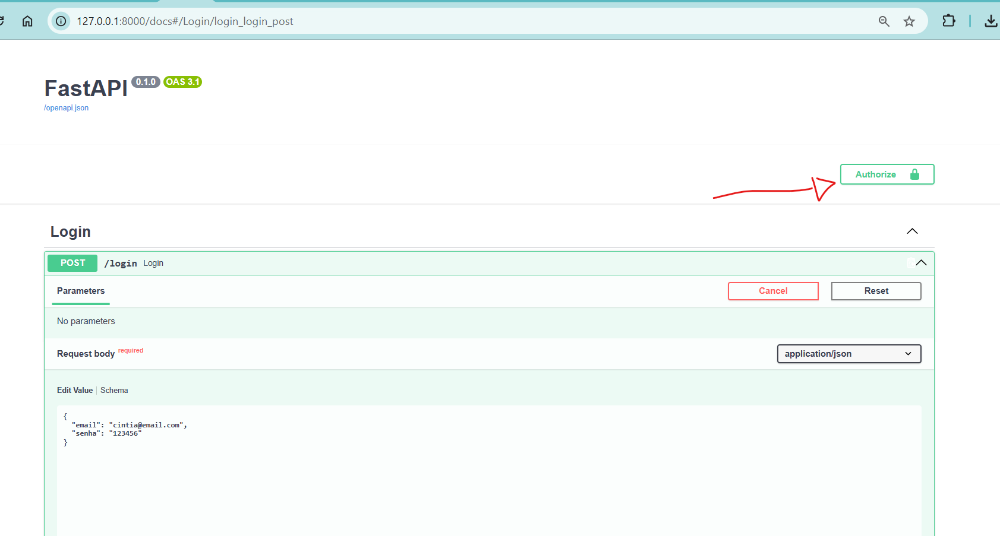
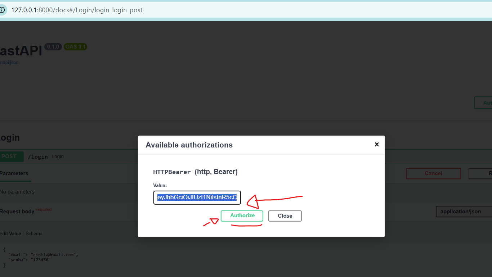

# Aula 14 — Protegendo as Rotas da API

## Antes de começar — relembrando o ambiente

Se a máquina foi reiniciada desde a última aula, repita os passos de sempre antes de continuar:

1. **Importe o banco de novo** no phpMyAdmin, aba **Importar**, usando `banco/estudio_tatuagem.sql`.
2. **Recrie o arquivo `.env`** dentro da pasta `backend`. Gere uma `SECRET_KEY` nova rodando isso no terminal (com o venv ativado — se ainda não tiver o venv, faça o próximo passo primeiro e volte aqui):
   ```powershell
   python -c "import secrets; print(secrets.token_hex(32))"
   ```
   Copie o texto que apareceu e monte o `.env` assim:
   ```
   DB_HOST=localhost
   DB_USER=root
   DB_PASSWORD=
   DB_NAME=estudio_tatuagem
   SECRET_KEY=cole_aqui_o_texto_que_apareceu
   ```
   (mesmo processo da Aula 13, Parte 2 — lembrando que gerar uma chave nova é normal e não quebra nada, é só logar de novo depois)
3. **Recrie e ative o ambiente virtual**, dentro da pasta `backend`:
   ```powershell
   cd backend
   python -m venv venv
   .\venv\Scripts\Activate.ps1
   ```
4. **Reinstale as dependências e rode a API:**
   ```powershell
   pip install -r requirements.txt
   uvicorn main:app --reload
   ```

> **Lembrete das Aulas 7/8:** você vai criar o arquivo `backend/seguranca.py` nessa aula. Se algo não funcionar como esperado com o servidor já ligado, pare com **Ctrl+C** e rode `uvicorn main:app --reload` de novo.

---

## O que vamos fazer nessa aula

1. Entender o que é `Depends`, o "segurança de porta" do FastAPI
2. Criar a função que confere se um token é válido
3. Aplicar essa proteção nas 5 rotas que já existem (clientes, senioridade, estilos, tatuadores, agendamentos)
4. Testar tudo usando o botão "Authorize" do `/docs`

---

## Parte 1 — O que é `Depends`

Pense numa balada com área VIP. Na entrada geral, ninguém confere nada. Mas na porta da área VIP, tem um segurança: antes de você entrar, ele confere sua pulseirinha. Se não tiver pulseirinha, ou se ela não for válida, você nem chega a entrar — o segurança te barra ali mesmo, antes de qualquer coisa acontecer lá dentro.

No FastAPI, `Depends` é exatamente esse segurança: uma função que roda **antes** da rota em si, e pode **bloquear** a requisição se algo estiver errado. Se o `Depends` deixar passar, a rota roda normalmente. Se ele barrar, a rota nem chega a ser executada.

Vamos criar um `Depends` que funciona assim: confere se veio um token JWT válido junto com a requisição. Se vier, deixa passar. Se não vier (ou vier um token falso/expirado), barra com um erro `401` ("não autorizado").

---

## Parte 2 — Backend: a função que confere o token

Crie `backend/seguranca.py` (fica ao lado de `database.py`, não dentro de `rotas/`, porque não é uma rota — é uma função que várias rotas vão usar):

```python
# ============================================================
# seguranca.py — Verificação do token JWT
# Descrição: Função usada pelas rotas protegidas para conferir
#            se quem está fazendo a requisição tem um token válido.
# ============================================================

from fastapi import Depends, HTTPException
from fastapi.security import HTTPBearer, HTTPAuthorizationCredentials
import jwt
import os

SECRET_KEY = os.getenv("SECRET_KEY")
ALGORITMO = "HS256"

# HTTPBearer() é o que faz o botão "Authorize" aparecer no /docs
esquema_token = HTTPBearer()

# "Segurança de porta" — confere se o token que veio na requisição é válido
def verificar_token(credenciais: HTTPAuthorizationCredentials = Depends(esquema_token)):
    token = credenciais.credentials   # o texto do token, sem a palavra "Bearer" na frente

    try:
        payload = jwt.decode(token, SECRET_KEY, algorithms=[ALGORITMO])
        return payload   # se quiser, uma rota específica pode usar isso pra saber quem logou
    except jwt.ExpiredSignatureError:
        raise HTTPException(status_code=401, detail="Token expirado, faça login de novo")
    except jwt.InvalidTokenError:
        raise HTTPException(status_code=401, detail="Token inválido")
```

> **Diferença pra Aula 13:** lá, usamos `options={"verify_signature": False}` só pra espiar o conteúdo do token, sem checar nada. Aqui, `jwt.decode(token, SECRET_KEY, algorithms=[ALGORITMO])` **confere a assinatura de verdade** — se alguém tentar inventar um token sem saber a `SECRET_KEY`, cai no `except` e é barrado.

---

## Parte 3 — Aplicando a proteção no `main.py`

Aqui está a parte boa: não precisamos tocar em nenhum dos arquivos de rota que já existem. Igual fizemos com `prefix` e `tags` na Aula 11, a proteção entra como mais um parâmetro no `include_router(...)`.

Atualize os imports do `main.py`:

```python
from fastapi import FastAPI, Depends
from seguranca import verificar_token
```

E adicione `dependencies=[Depends(verificar_token)]` nas 5 rotas que devem exigir login — **menos** `login` e `usuarios`, que continuam livres (faz sentido: ninguém tem token antes de logar ou se cadastrar):

```python
app.include_router(login.router, tags=["Login"])
app.include_router(usuarios.router, prefix="/usuarios", tags=["Usuários"])
app.include_router(clientes.router, prefix="/clientes", tags=["Clientes"], dependencies=[Depends(verificar_token)])
app.include_router(senioridade.router, prefix="/senioridade", tags=["Senioridade"], dependencies=[Depends(verificar_token)])
app.include_router(estilos.router, prefix="/estilos", tags=["Estilos"], dependencies=[Depends(verificar_token)])
app.include_router(tatuadores.router, prefix="/tatuadores", tags=["Tatuadores"], dependencies=[Depends(verificar_token)])
app.include_router(agendamentos.router, prefix="/agendamentos", tags=["Agendamentos"], dependencies=[Depends(verificar_token)])
```

> **Por que `login` e `usuarios` ficam de fora?** Porque exigir um token pra conseguir logar ou se cadastrar seria um contrassenso — ninguém tem token nenhum antes dessas duas ações. Essas duas rotas são a "porta de entrada", ficam sempre livres.

> **Um limite importante pra ter em mente:** como o cadastro é público, **qualquer pessoa pode criar uma conta e logar** — e, uma vez logada, tem exatamente o mesmo acesso que um funcionário de verdade. Isso acontece porque `verificar_token` confere só **uma coisa**: "esse token é válido?". Ela não olha pro `tipo` do usuário (`admin`, `funcionario`, `cliente`) pra decidir o que cada um pode ou não fazer. Ou seja, hoje resolvemos **autenticação** (provar que você tem uma conta válida), mas ainda não **autorização** (checar se você deveria ter acesso àquilo específico). Isso é aceitável pro momento do curso, mas numa aplicação real seria um problema — esse é justamente o assunto que o campo `tipo`, preparado desde a Aula 12, está esperando pra uma aula futura.

**Teste:** acesse `/docs` e recarregue a página. Deve aparecer um cadeado 🔒 do lado de cada rota protegida, e um botão **"Authorize"** no topo da página.

**Teste:** veja que se você tentar listar os cliente por exemplo ele não vai mais deixar, a não ser que esteja autenticado

---

## Parte 4 — Testando a proteção

**1. Teste sem token.** No `/docs`, tente `GET /clientes` sem fazer nada antes. Deve devolver erro `401`, com `"detail": "Not authenticated"`.

**2. Faça login.** Use `POST /login` (Aula 13) com um usuário válido, e copie o `access_token` da resposta.

**3. Clique em "Authorize"** (canto superior direito do `/docs`). Cole o token no campo que aparecer e confirme. A janela deve fechar e os cadeados devem aparecer "fechados" (indicando que você está autenticado).

Veja onde clicar e onde colar o token:





**4. Teste `GET /clientes` de novo.** Agora deve funcionar normalmente (`200`, com a lista de clientes).

**5. Teste com um token errado.** Clique em "Authorize" de novo, apague o token, cole qualquer texto aleatório, e teste `GET /clientes` — deve voltar `401`, com `"detail": "Token inválido"`.

---

## Erros comuns

- **Colar o token no "Authorize" e continuar dando `401`:** confira se você colou só o token puro, sem a palavra `Bearer` na frente — o Swagger já adiciona isso sozinho. Se mesmo assim não funcionar, tente colar `Bearer SEU_TOKEN` (com espaço) — dependendo da versão do FastAPI, o campo espera um formato ou outro. Se acontecer isso com você, me avisa que ajustamos juntas.
- **`/login` ou `/usuarios` também pedindo token:** confira se o `dependencies=[Depends(verificar_token)]` não foi colocado sem querer nessas duas linhas do `main.py` — elas devem ficar de fora.
- **Erro dizendo que `SECRET_KEY` é `None`:** mesma causa da Aula 13 — confira se a linha `SECRET_KEY=...` está no `.env` e se você reiniciou o servidor depois de criar/editar o arquivo.
- **Token de ontem não funciona mais:** se a máquina resetou e você gerou uma `SECRET_KEY` nova (lembrete da Aula 13), qualquer token antigo para de ser reconhecido. Faça login de novo pra ganhar um token novo, assinado com a chave de hoje.

---

## Estrutura do projeto até agora

```
estudio-tatuagem-api/
├── aulas/
├── backend/
│   ├── rotas/
│   │   ├── clientes.py
│   │   ├── senioridade.py
│   │   ├── estilos.py
│   │   ├── tatuadores.py
│   │   ├── agendamentos.py
│   │   ├── usuarios.py
│   │   └── login.py
│   ├── venv/
│   ├── .env
│   ├── database.py
│   ├── seguranca.py         ← novo
│   ├── main.py               ← atualizado (proteção nas 5 rotas)
│   └── requirements.txt
├── frontend/
│   └── (sem mudanças nessa aula — o login na tela vem na Aula 15)
├── banco/
│   └── estudio_tatuagem.sql
├── .gitignore
└── REGRAS.md
```

---

## Próxima aula

A API já está protegida de verdade — mas o `frontend/` ainda não sabe nada sobre login: nenhuma tela pede senha, e nenhum `fetch` manda o token junto. Na **Aula 15**, vamos criar a tela de login de verdade, um Dashboard, e atualizar as 5 telas existentes pra mandar o token em toda requisição — fechando o ciclo que começou na Aula 12.
