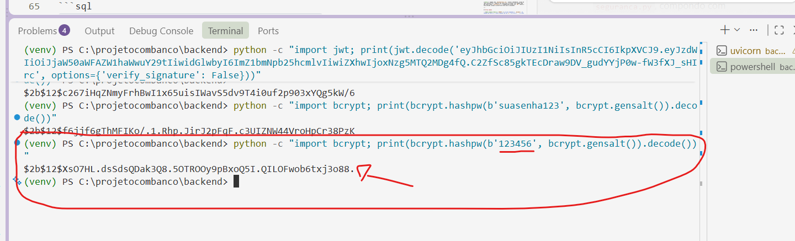

# Aula 16 — Autorização por Tipo de Usuário

## Antes de começar — relembrando o ambiente

Se a máquina foi reiniciada desde a última aula, repita os passos de sempre antes de continuar:

1. **Importe o banco de novo** no phpMyAdmin, aba **Importar**, usando `banco/estudio_tatuagem.sql`.
2. **Recrie o arquivo `.env`** dentro da pasta `backend`, com a `SECRET_KEY`:
   ```powershell
   python -c "import secrets; print(secrets.token_hex(32))"
   ```
   ```
   DB_HOST=localhost
   DB_USER=root
   DB_PASSWORD=
   DB_NAME=estudio_tatuagem
   SECRET_KEY=cole_aqui_o_texto_que_apareceu
   ```
3. **Recrie e ative o ambiente virtual**, dentro da pasta `backend`:
   ```powershell
   cd backend
   python -m venv venv
   .\venv\Scripts\Activate.ps1
   ```
4. **Reinstale as dependências e rode a API:**
   ```powershell
   pip install -r requirements.txt
   uvicorn main:app --reload
   ```

Essa aula só edita o `seguranca.py` que já existe (não cria arquivo de rota novo), então não precisa do lembrete de reiniciar por causa de arquivo novo.

---

## O que vamos fazer nessa aula

1. Entender por que fechar o cadastro público agora que existe o conceito de `admin`
2. Criar o primeiro usuário administrador direto no banco
3. Criar uma segunda camada de segurança, que confere o `tipo` do usuário, não só se o token é válido
4. Proteger a rota de cadastro, exigindo ser `admin`
5. Mover a tela de cadastro pra dentro da área logada

---

## Parte 1 — Fechando a lacuna da Aula 14

Lembra do aviso na Aula 14: "qualquer pessoa pode se cadastrar e ter acesso total, porque `verificar_token` só confere se o token é válido, não confere o `tipo`"? Chegou a hora de resolver isso.

A partir de agora, `POST /usuarios` (cadastro) deixa de ser público — só um **administrador já logado** poderá cadastrar novos funcionários. Isso esbarra num problema: **se o cadastro exige login, como a primeira conta é criada?** A resposta é sempre a mesma em qualquer sistema real: **a primeira conta nasce fora da API**, direto no banco — é o que vamos fazer na Parte 2.

> **Isso não fecha a porta pro cliente se cadastrar sozinho no futuro.** São dois cadastros diferentes, mesmo usando a mesma tabela `usuario`: essa rota (`POST /usuarios`) é só pra criar conta de **equipe** (`admin`/`funcionario`), por isso faz sentido exigir um admin. Quando um dia vocês construírem o cliente se cadastrando sozinho pra agendar online, isso vai ser uma **rota nova e separada** (por exemplo `POST /clientes/cadastro`), de propósito pública — porque o cliente, óbvio, ainda não tem conta nenhuma na primeira vez. Nada fica escondido incorretamente: o cadastro de cliente nunca ia usar essa `/usuarios` protegida mesmo.

---

## Parte 2 — Criando o primeiro administrador

Como não existe mais um jeito de se cadastrar pela API sem já ser admin, vamos gerar o hash da senha manualmente, do mesmo jeito que a rota de cadastro faz por baixo dos panos (Aula 12), só que rodando direto no terminal:

```powershell
python -c "import bcrypt; print(bcrypt.hashpw(b'suasenha123', bcrypt.gensalt()).decode())"
```
Veja o hash aparecendo no terminal — é esse texto que você vai copiar pra criar o usuário no phpMyAdmin:




> **Atenção com o `b'suasenha123'`:** o `b` antes das aspas diz ao Python "isso é uma senha, tipo bytes" — é o que o `bcrypt.hashpw` espera. Troque `suasenha123` pela senha que você quiser usar. E não esqueça do `.decode()` no final: sem ele, o resultado vem com `b'...'` ao redor (incluindo essas letras/aspas), o que corrompe o hash se você colar assim no banco.

Copie o texto que apareceu (algo tipo `$2b$12$KIXQ...`) e, no phpMyAdmin, rode:

```sql
INSERT INTO usuario (nome, email, senha, tipo)
VALUES ('Administrador', 'admin@estudio.com', 'COLE_O_HASH_AQUI', 'admin');
```

**Teste:** faça login (`POST /login`) com `admin@estudio.com` e a senha que você escolheu. Copie o `access_token` e decodifique ele (mesmo comando da Aula 13):

```powershell
python -c "import jwt; print(jwt.decode('SEU_TOKEN_AQUI', options={'verify_signature': False}))"
```

O resultado deve mostrar `'tipo': 'admin'`.

---

## Parte 3 — Backend: uma segunda camada de segurança

Em `backend/seguranca.py`, adicione uma nova função no final do arquivo (não mexa em `verificar_token`, que já existe — só acrescente):

```python
# "Segurança de porta" mais rigoroso — além de conferir o token, exige que seja admin
def verificar_admin(payload: dict = Depends(verificar_token)):
    if payload.get("tipo") != "admin":
        raise HTTPException(status_code=403, detail="Acesso restrito a administradores")
    return payload
```

> **Repare que `verificar_admin` usa `verificar_token` por dentro** (`Depends(verificar_token)`, no parâmetro) — primeiro confere se o token é válido (igual sempre), e só depois checa se o `tipo` é `admin`. É um "segurança" em cima do outro "segurança": passou pelo primeiro, ainda falta passar pelo segundo.
>
> **Por que `403` e não `401`?** `401` significa "eu não sei quem você é" (token ausente ou inválido). `403` significa "eu sei quem você é, mas você não tem permissão pra isso" — é o caso de um `funcionario` de verdade, logado normalmente, tentando cadastrar outro funcionário.

---

## Parte 4 — Protegendo a rota de cadastro

Em `backend/main.py`, atualize a linha do `usuarios`:

```python
app.include_router(usuarios.router, prefix="/usuarios", tags=["Usuários"], dependencies=[Depends(verificar_admin)])
```

E adicione `verificar_admin` no import, junto com `verificar_token`:

```python
from seguranca import verificar_token, verificar_admin
```

**Teste, na ordem:**
1. Sem token nenhum, tente `POST /usuarios` no `/docs` — deve dar `401`.
2. Faça login com uma conta comum (`funcionario`, cadastrada antes da Aula 16) e tente `POST /usuarios` de novo, com esse token no Authorize — deve dar `403` ("Acesso restrito a administradores"). **Isso é o esperado, não um erro.**
3. Faça login com a conta `admin@estudio.com` e tente `POST /usuarios` de novo — agora deve funcionar (`200`).

---

## Parte 5 — Frontend: cadastro vira uma tela protegida

Como `/usuarios` agora exige ser admin, a tela de cadastro deixa de ser algo que qualquer visitante acessa pela Landing Page — vira uma ação de administrador, dentro da área logada.

**1.** Em `frontend/cadastro.html`, adicione o `auth.js` antes do script da própria tela:

```html
<script src="js/auth.js"></script>
<script src="js/cadastro.js"></script>
```

**2.** Em `frontend/js/cadastro.js`, adicione `protegerPagina()` logo no início, e troque o `fetch` pelo `fetchAutenticado`:

```javascript
protegerPagina()   // bloqueia a página se não tiver login
```

```javascript
// Antes:
const resposta = await fetch(`${API}/usuarios`, {

// Depois:
const resposta = await fetchAutenticado(`${API}/usuarios`, {
```

**3.** Em `frontend/index.html` (Landing Page), **remova** o botão "Cadastrar" — ele não faz mais sentido pra quem ainda não tem conta:

```html
<!-- Antes -->
<a href="cadastro.html" class="btn btn-outline-light me-2">Cadastrar</a>
<a href="login.html" class="btn btn-light">Entrar</a>

<!-- Depois -->
<a href="login.html" class="btn btn-light">Entrar</a>
```

**4.** Em `frontend/dashboard.html`, **adicione** um link pra cadastro — agora é uma ação de dentro do painel, não da porta de entrada:

```html
<div class="col-md-4">
  <a href="cadastro.html" class="btn btn-secondary w-100 py-3">Novo Funcionário</a>
</div>
```

**Teste:** logada como `admin@estudio.com`, acesse o Dashboard, clique em "Novo Funcionário", cadastre uma conta nova. Se tentar isso logada como uma conta comum (`funcionario`), a chamada deve falhar com `403` (mesmo a tela abrindo, porque a proteção de fato mora no backend).

---

## Erros comuns

- **Hash colado errado no `INSERT`:** se você esqueceu o `.decode()` no comando da Parte 2, o texto copiado vem com `b'` no início e `'` no final — apague essas sobras antes de colar no SQL, ou rode o comando de novo com `.decode()`.
- **`403` mesmo logada como admin:** confira se o usuário `admin@estudio.com` realmente foi criado com `tipo = 'admin'` no `INSERT` (não `'funcionario'` por engano), e se você fez login de novo depois de criar a conta (um token gerado antes do `INSERT` não teria o `tipo` certo).
- **A tela de cadastro "trava" achando que deu certo, mas nada foi criado:** olhe a aba Network do navegador (F12) — se a resposta for `403`, é porque quem está logado não é admin. Isso é comportamento esperado, não bug.

---

## Estrutura do projeto até agora

```
estudio-tatuagem-api/
├── aulas/
├── backend/
│   ├── seguranca.py          ← atualizado (verificar_admin)
│   ├── main.py                ← atualizado (proteção admin no /usuarios)
│   └── (resto sem mudanças)
├── frontend/
│   ├── index.html             ← atualizado (sem botão Cadastrar)
│   ├── dashboard.html         ← atualizado (link Novo Funcionário)
│   ├── cadastro.html          ← atualizado (protegido)
│   ├── js/
│   │   └── cadastro.js        ← atualizado (fetchAutenticado)
│   └── (resto sem mudanças)
├── banco/
│   └── estudio_tatuagem.sql
├── .gitignore
└── REGRAS.md
```

> Lembre de exportar o banco de novo, agora com o usuário `admin` criado.

---

## Próxima aula

Com autenticação e autorização básica funcionando, o sistema cobre as operações principais de um estúdio de tatuagem de ponta a ponta — banco, API protegida e telas conectadas. Os próximos passos ficam a critério de vocês: dar mais acabamento visual às telas, pensar no cadastro do próprio cliente (usando o `idcliente` que já está preparado na tabela `usuario` desde a Aula 12), ou até pensar em como isso seria publicado fora do computador de um só, na internet.
